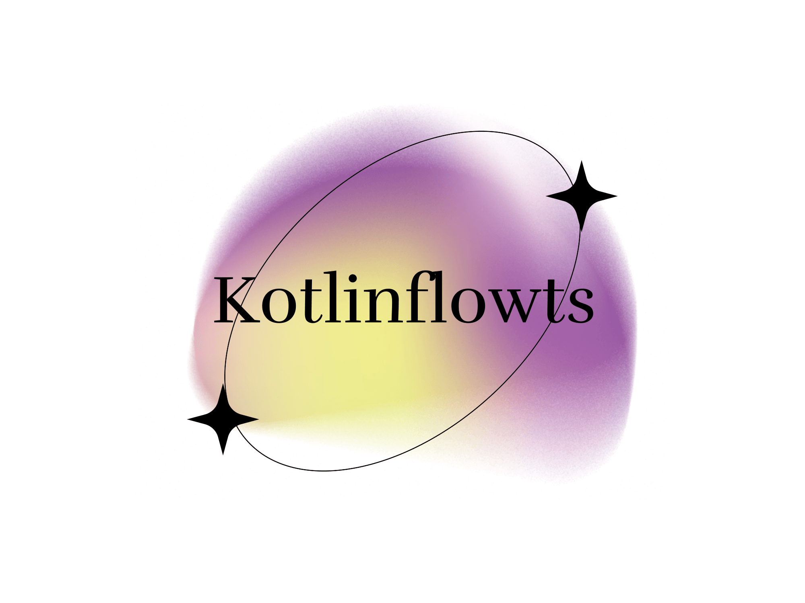

<p align="center"></p>

# KotlinFlowts

![badge][badge-android]
![badge][badge-jvm]
![badge][badge-linux]
![badge][badge-mac]
![badge][badge-windows]
![badge][badge-web]

## Features

### Key Features:
- **Add Components**: Easily add reusable components to your application.
- **Add Screens**: Seamlessly create and manage multiple screens.
- **Edit Components**: Modify and update existing components to suit your needs.
- **Generate Code**: Automatically generate the necessary code for screens and components.

### Desktop Demo
Take a look at the interactive demo below to see these features in action:

[](https://youtu.be/svuioMgov5A)

## Running the Application

### Android
To build the application bundle for Android:
- Run `./gradlew :composeApp:assembleDebug`

### Desktop
To run the desktop application:
- Run `./gradlew :composeApp:run`

### Web/Js
To run the web application:
- Run `./gradlew :composeApp:jsBrowserDevelopmentRun`

## For Devs:

### App Builder DSL

A declarative way to build your applications using a simple and intuitive Kotlin DSL.

#### Basic Structure

```kotlin
buildApp {
    name("MyApp")              // Set your app name
    screen("User Profile")   // Create a screen
    // Add components here
    
}
```
#### Available Components

##### Layout Components

- row { } - Creates a horizontal container for components

- column { } - Creates a vertical container for components

##### Input Components

- textField("Label") - Single-line text input

- textFieldArea("Label") - Multi-line text input

- numberField("Label") - Numeric input field

- dateField("Label") - Date picker component

- dropdown("Label") - Single-select dropdown menu

- multiSelect("Label") - Multi-select dropdown menu

##### Display Components

- text("Label") - Static text display

- image("Label") - Image upload/display component

- signature("Label") - Signature capture component

#### Example Usage

```kotlin
buildApp {
    name("Employee Directory")
    
    screen("Personal Information") {
        row {
            textField("First Name")
            textField("Last Name")
        }
        column {
            textFieldArea("Address")
            numberField("Phone Number")
            dateField("Date of Birth")
        }
        row {
            dropdown("Department")
            multiSelect("Skills")
        }
        signature("Employee Signature")
    }
    
    screen("Documents") {
        column {
            text("Please upload required documents")
            image("Profile Photo")
            image("ID Card")
        }
    }
}
```

Each component can be customized further with properties and event handlers.

## Contribute

Welcome, contribute!

[badge-android]: http://img.shields.io/badge/-android-6EDB8D.svg?style=flat
[badge-jvm]: http://img.shields.io/badge/-jvm-DB413D.svg?style=flat
[badge-linux]: http://img.shields.io/badge/-linux-2D3F6C.svg?style=flat
[badge-windows]: http://img.shields.io/badge/-windows-4D76CD.svg?style=flat
[badge-mac]: http://img.shields.io/badge/-macos-111111.svg?style=flat
[badge-web]: https://img.shields.io/badge/-web-3498db.svg?style=flat
