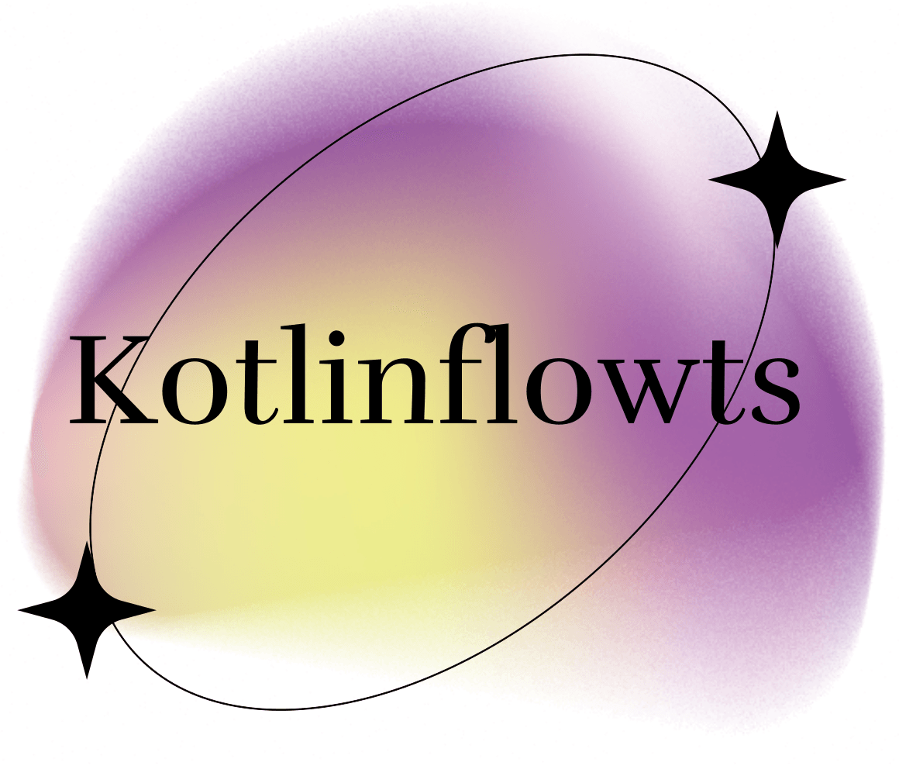

# KotlinFlowts

![badge][badge-android]
![badge][badge-jvm]
![badge][badge-linux]
![badge][badge-mac]
![badge][badge-windows]
![badge][badge-web]

## Features

### Key Features:
- **Add Components**: Easily add reusable components to your application.
- **Add Screens**: Seamlessly create and manage multiple screens.
- **Edit Components**: Modify and update existing components to suit your needs.
- **Generate Code**: Automatically generate the necessary code for screens and components.

### Demo
Take a look at the interactive demo below to see these features in action:

## Running the Application

### Android
To build the application bundle for Android:
- Run `./gradlew :composeApp:assembleDebug`

### Desktop
To run the desktop application:
- Run `./gradlew :composeApp:run`

### Web/Js
To run the web application:
- Run `./gradlew :composeApp:jsBrowserDevelopmentRun`

## Contribute

Welcome, contribute!

[badge-android]: http://img.shields.io/badge/-android-6EDB8D.svg?style=flat
[badge-jvm]: http://img.shields.io/badge/-jvm-DB413D.svg?style=flat
[badge-linux]: http://img.shields.io/badge/-linux-2D3F6C.svg?style=flat
[badge-windows]: http://img.shields.io/badge/-windows-4D76CD.svg?style=flat
[badge-mac]: http://img.shields.io/badge/-macos-111111.svg?style=flat
[badge-web]: https://img.shields.io/badge/-web-3498db.svg?style=flat
